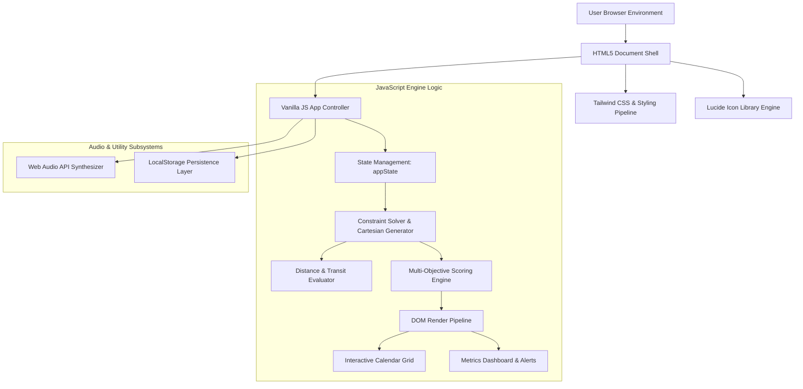

# 🏗️ ARCHITECTURE.MD - System Architecture & Technical Blueprint

> **System**: CourseFlow & OmniCalc Pro  
> **Architecture Pattern**: Single-Page Application (SPA) / Client-Side State-Driven Engine

---

## 1. High-Level System Architecture

CourseFlow and OmniCalc Pro follow a **decoupled client-side SPA architecture**. The application runs entirely inside the user's browser, eliminating latency and server requirements while delivering instant interactive feedback.



---

## 2. Technology Stack

| Layer | Technology | Purpose & Rationale |
| :--- | :--- | :--- |
| **Markup** | HTML5 | Semantic structure, accessible attributes, zero-build simplicity. |
| **Styling** | Tailwind CSS (CDN) | Utility-first CSS framework for rapid dark/light dashboard design. |
| **Icons** | Lucide Icons (CDN) | Modern vector icon set rendered dynamically via JavaScript. |
| **Logic & Engine** | ES6 Vanilla JavaScript | Zero-framework runtime for peak execution performance (<10ms solver). |
| **Sound Synthesis** | Web Audio API | Client-side audio synthesizer generating crisp UI click sounds. |
| **Persistence** | `localStorage` API | Persists user calculation history, custom courses, and theme settings. |

---

## 3. Core Engine Components

### 3.1 Constraint Satisfaction Solver (`solveSchedules`)
- **Cartesian Product Generator**: Combines available section choices for all user-selected courses ($S_1 \times S_2 \times \dots \times S_n$).
- **Pruning Pipeline**:
  1. *Time Overlap Pruning*: Evaluates day bitmasks and minute intervals $[t_{\text{start}}, t_{\text{end}}]$.
  2. *Friday Exclusion Pruning*: Drops schedules containing Friday sessions when active.
  3. *Start Time Boundary Check*: Drops schedules with classes before $T_{\text{earliest}}$.
  4. *Consecutive Class Chain Analysis*: Tracks back-to-back class counts per day.

### 3.2 Transit Distance Evaluator & Alerting
- Uses a 2D lookup map `DISTANCE_MATRIX[buildingA][buildingB]` returning walking time in minutes ($W_{\text{transit}}$).
- For consecutive classes $C_1$ and $C_2$ on day $D$:
  $$\text{Gap} = t_{\text{start}}(C_2) - t_{\text{end}}(C_1)$$
  $$\text{If } W_{\text{transit}} > \text{Gap} \implies \text{Trigger Tight Transition Alert!}$$

### 3.3 Multi-Objective Scoring Engine
Calculates normalized match score $S_{\text{match}} \in [0, 100]$:
$$S_{\text{prof}} = \left( \frac{\overline{\text{RMP}} - 1}{4} \right) \times 100$$
$$S_{\text{walk}} = \max\left(0, 100 - (\text{TotalWalkMinutes} \times 1.5)\right)$$
$$S_{\text{match}} = \frac{w_{\text{prof}} \cdot S_{\text{prof}} + w_{\text{walk}} \cdot S_{\text{walk}}}{w_{\text{prof}} + w_{\text{walk}}}$$

---

## 4. Render & Layout Pipeline

```
[ User Action / Preference Change ]
               │
               ▼
   [ Update appState Object ]
               │
               ▼
    [ Execute solveSchedules() ]
               │
               ▼
[ Sort & Rank Valid Schedule Array ]
               │
               ▼
  [ Execute renderUI() Render Loop ]
       ├── renderCourseChecklist()
       ├── renderCalendar() (Grid Math: Top % & Height %)
       └── renderMetrics() & Lucide Icon Refresh
```
